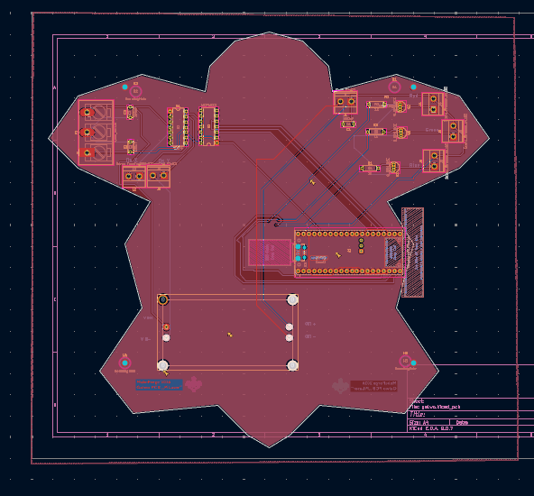

# PicoLaser: Open Source Wireless Vector Projector

So, this is it—PicoLaser. It’s basically my way of flipping the bird to the massive wallet-drain that usually comes with laser hobbyism. If you’ve ever looked into buying a commercial ILDA controller, you know the drill: proprietary junk, ancient software, and price tags that make you want to go lie down. I wanted something better. I wanted a wireless, scrappy, open-source "shield" for the Raspberry Pi Pico W that could actually hold its own against the big guys without requiring a small loan.

## 🎯 The Vision (Or: Why am I doing this?)
Commercial systems are usually black boxes. You plug them in, they work (hopefully), and you have zero clue what’s happening under the hood. PicoLaser changes that. By leaning on the dual-core RP2040, I’ve managed to get rock-solid, real-time vector control. No OS lag, no weird Linux jitters—just clean lines. 

And yeah, it’s shaped like a turtle. Why? Because I’m "PanZolw," and because the world needs more hardware that doesn't just look like a boring green rectangle.

## ⚙️ What’s actually under the shell?

### 1. The "Real-Time" Secret Sauce
I swapped the beefy Pi 4 for a **Raspberry Pi Pico W**. To be honest, it was the best move I made. Running a laser on a full OS is overkill; it's like using a chainsaw to cut butter. The Pico W handles the WiFi data stream and the high-speed SPI communication simultaneously without breaking a sweat. Six bucks for the brain of a laser projector? I almost feel like I'm stealing.

### 2. Movement & The Mirror Game
*   **The DAC:** I’m using the **MCP4922**. It’s a 12-bit, 2-channel workhorse that translates "move left" or "move right" into voltages the mirrors can actually understand.
*   **Buffer Stage:** A **TL074** Op-Amp sits right behind the DAC. It’s the "muscle," making sure the signals don't sag when they hit the galvo scanners. It plays nice with pretty much any standard 20k to 40kpps set.

### 3. The Seven-Color Hack
Instead of expensive analog modulation (which is great, don't get me wrong, but it’s pricey), I went with **TTL control**. By using some fast NPN transistors—good old 2N2222s—I can toggle the Red, Green, and Blue diodes on and off at light speed. You don't get subtle sunset fades, but you *do* get seven punchy, vibrant colors. For 90% of vector art and logos? It’s more than enough.

### 4. Power & Protection (Keeping the magic smoke inside)
Powering this thing is a bit of a juggling act, but I think I’ve got it nailed.
*   **Dual Rails:** You’ve got the **+/- 15V** for the analog Op-Amps and a **12V/24V** main input for the heavy lifting.
*   **The Buck Converter:** I tucked an **LM2596** on-board to step everything down to a clean 5V for the Pico and the lasers.
*   **Safety First:** I designed it with **VSYS injection**. This is huge—it means you can have the external power cranked up and still plug in your USB cable to tweak the code without frying your laptop's motherboard. 

## 📸 The Build So Far

### System Schematic (The "Eco" Rev)
The lean, mean version. No secondary DACs, just pure efficiency and transistor-based switching.

### PCB Design (The "Turtle" HAT)
The final render. Matte Black solder mask, Gold (ENIG) finish, and that hexagonal shell pattern. I’m pretty proud of how the power and signal domains are separated—clean signals are happy signals.

## 📦 What's it gonna cost?
I’ve put together a full Bill of Materials (BOM) in the root directory. If you’re smart about where you buy your parts, you can build this whole rig for **under $150**. 
[View the BOM here](./BOM.csv)

## 🛠 Current Status
*   [x] **Hardware Design:** Locked and loaded.
*   [x] **The Aesthetic:** Turtle shape is finalized.
*   [x] **Footprints:** Verified (thanks, calipers).
*   [ ] **Fabrication:** Files are at the fab house. Now we wait.
*   [ ] **Assembly:** Pending (need to find my tweezers).

## 📄 License
This project is open-source hardware. Build it, mod it, just don't be a jerk about it.
