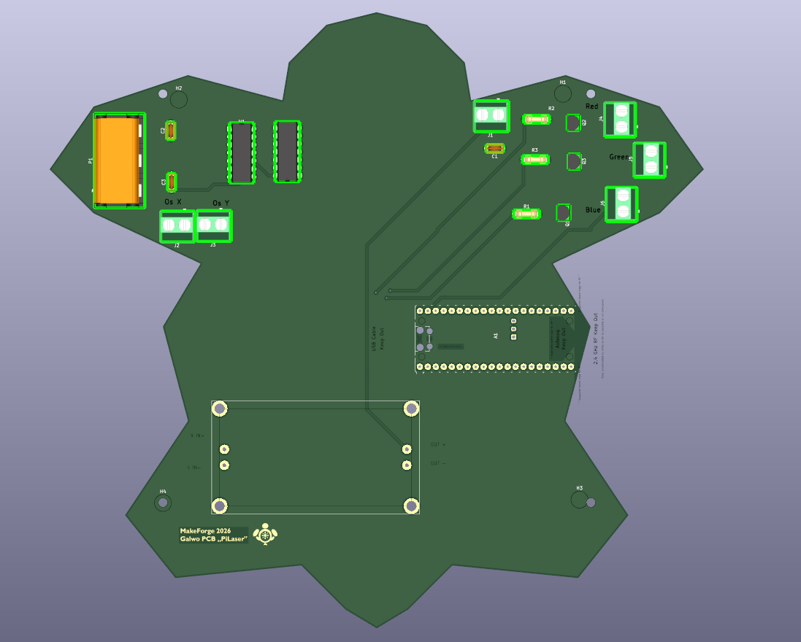
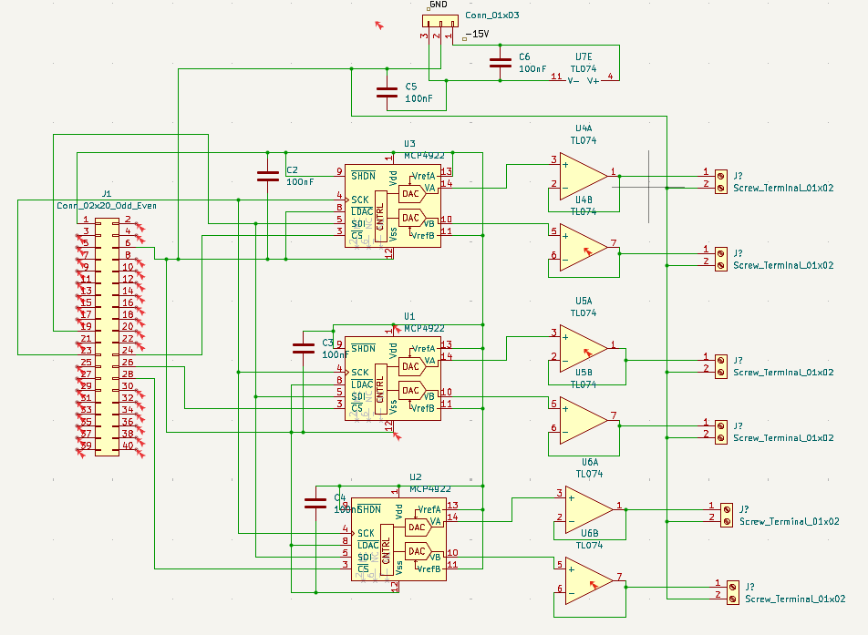

# PiLaser: Open Source Wireless RGB Vector Projector

A completely open-source, DIY laser vector display controller designed as a **Raspberry Pi HAT**. This project aims to provide a low-cost, wireless alternative to expensive commercial ILDA controllers, enabling real-time vector graphics projection over WiFi.

## 🎯 Project Goals
Commercial laser show systems often rely on proprietary hardware or expensive DACs. **PiLaser** bridges the gap by using a Raspberry Pi 4 combined with a custom high-performance HAT to drive standard ILDA galvanometers and analog RGB laser modules.

**Key Features:**
*   **5-Channel Analog Control:** Independent control for X-Axis, Y-Axis, Red, Green, and Blue intensity.
*   **High Precision:** Uses three daisy-chained **MCP4922** (12-bit) DACs for smooth lines and gradients.
*   **True Analog Modulation:** Supports color fading/mixing (not just 7-color TTL).
*   **Wireless:** Takes advantage of Raspberry Pi's WiFi to receive vector data wirelessly.
*   **Standard Compliance:** Designed to drive standard 20kpps-40kpps galvo scanners (+/- 5V signal).

## ⚙️ Technical Architecture

The system is built around a custom PCB (The PiLaser HAT) designed in KiCad.

### 1. Digital Stage (The Brain)
*   **Controller:** Raspberry Pi 4 (or Zero 2 W).
*   **Interface:** High-speed SPI bus (GPIO 10, 11) communicating with the DACs.
*   **Logic Level:** 3.3V logic to match the RPi GPIO standard.

### 2. Analog Stage (The Heart)
*   **DACs:** 3x **MCP4922** chips.
*   **Op-Amps:** **TL074** Operational Amplifiers perform signal conditioning:
    *   **X/Y Channels:** Differential amplification to shift 0-3.3V DAC output to **+/- 5V** bipolar signal required by galvos.
    *   **RGB Channels:** Buffered 0-5V output for safe laser modulation.

### 3. Power & Safety
*   **Input:** Requires external **+/- 15V** dual-rail power supply for the Op-Amps.
*   **Filtering:** Extensive decoupling capacitors (Ceramic 100nF) on all ICs to ensure noise-free projection.
*   **Safety:** Designed with dedicated connectors for standard E-Stop integration.

## 📸 Gallery

### System Schematic
The complete electronic design handling the SPI communication and analog signal processing.

### PCB Design (3D View)
The physical layout of the HAT, featuring Phoenix-style connectors for reliable wiring.

## 📦 Bill of Materials (BOM)
A detailed cost breakdown and parts list (including sourcing links) is available in the root directory:
[View BOM.csv](./BOM.csv)

## 🛠 Status
*   [x] **Electronic Design:** Complete (Schematic & PCB Layout finished).
*   [x] **3D Modeling:** Board fit check complete.
*   [ ] **Fabrication:** Ready for PCB ordering.
*   [ ] **Assembly & Code:** Pending funding.

## 📄 License
This project is open-source hardware.